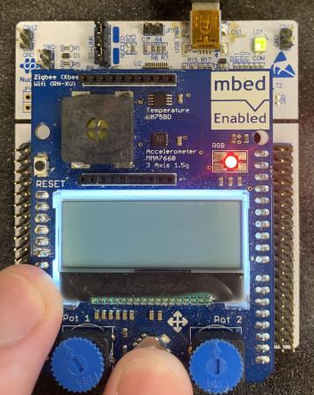

# 30010
Programmeringsprojekt.

Section titles link to folders with code for that exercise. Below the title is a (very) short description of what is used in that exercise. This makes it easier to find examples of certain solutions in future. 

## [Exercise 2](https://github.com/Group-00000011/30010/tree/main/journal/exc2)

Sinus LUT, Bit Mask, Bit shifting

## [Exercise 3](https://github.com/Group-00000011/30010/tree/main/journal/exc3)

ANSI to draw window and ball. Make screen output react to program. 

## [Exercise 4](https://github.com/Group-00000011/30010/tree/main/journal/exc4)

Setup GPIO ports/pins to both input and output.

setLED() sets the RBG LED to one of 7 colours (or turned off). 

